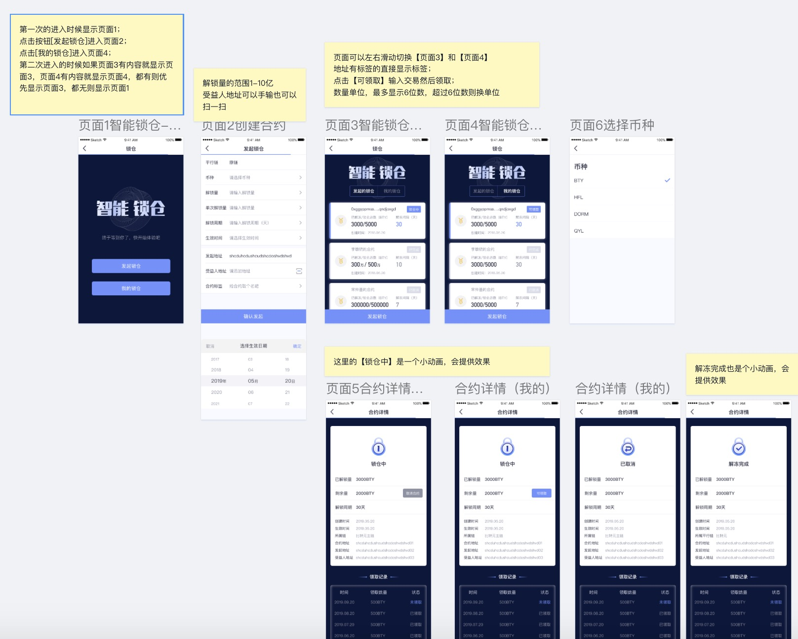

# freeze-client

文档：
- 合约说明 https://chain.33.cn/document/110
- UI https://lanhuapp.com/web/#/item/project/board?pid=69b98751-686d-4a69-b09c-5f24ac2985c7

配置说明：
- 应用必须运行在开源应用钱包的环境下：https://github.com/asmain6/WalletDemo
- 在应用根目录下可以找到corporate_points.config.js文件，进行应用的区块链配置
- 应用需在chain33区块链服务支持下使用，要自己部署chain33节点服务请查看 https://chain.33.cn
  
  ---

  项目名称:
  
    text: '',
    
  初始值
  
    value: 0,
    
  开源钱包部署地址 example:https://aiqianbao.net/fzmparanode/ :
    url: '',
  交易发送地址 example:http://token.aiqianbao.net/sendtx?txhash= :
    sendtoUrl_pre:'',
  合约执行名称  example:user.p.fzmstock :
    namespace: '',
  是否是平行链 如果合约运行在平行链请填 true :
    isParalle: true,
  基础币种名称 example:BTC :
    baseCoins: '',
  可选用的代币列表 example:[ { text: 'Bitcion', value: 0, assetSymbol: 'BTC', assetExec: 'coins' }] :
    assetsOption: []

    ---

- api doc https://doc.33.cn/index.do#/ffff-1528187631483-10163178175-0022/front/interfaceDetail/ffff-1562750492249-10163178175-0142

